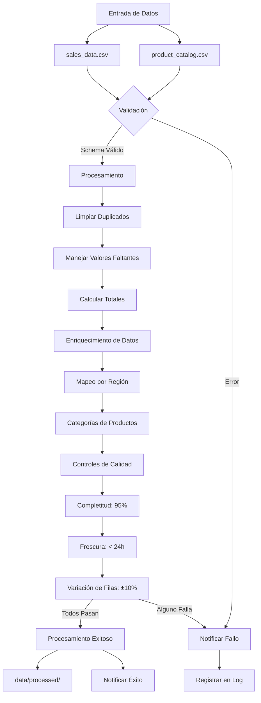

# Pipeline de Procesamiento de Datos de Ventas

Diagrama del flujo completo del pipeline de procesamiento de datos de ventas:

## Descripción de Fases

### 1. **Validación**
- Verifica que los archivos requeridos existan
- Valida el esquema contra `sales_schema_v1.json`

### 2. **Procesamiento**
- Limpiar Duplicados: Elimina registros duplicados
- Manejar Valores Faltantes: Procesa datos incompletos
- Calcular Totales: Computa agregaciones necesarias

### 3. **Enriquecimiento**
- Integra datos del catálogo de productos
- Aplica mapeos de regiones
- Clasifica productos por categorías

### 4. **Controles de Calidad**
- Completitud: Mínimo 95% de datos válidos
- Frescura: Datos con antigüedad máxima de 24 horas
- Variación: Tolerancia de ±10% en cambios de volumen

### 5. **Notificaciones**
- Genera alertas en caso de éxito o fallo
- Registra eventos en archivos de log
