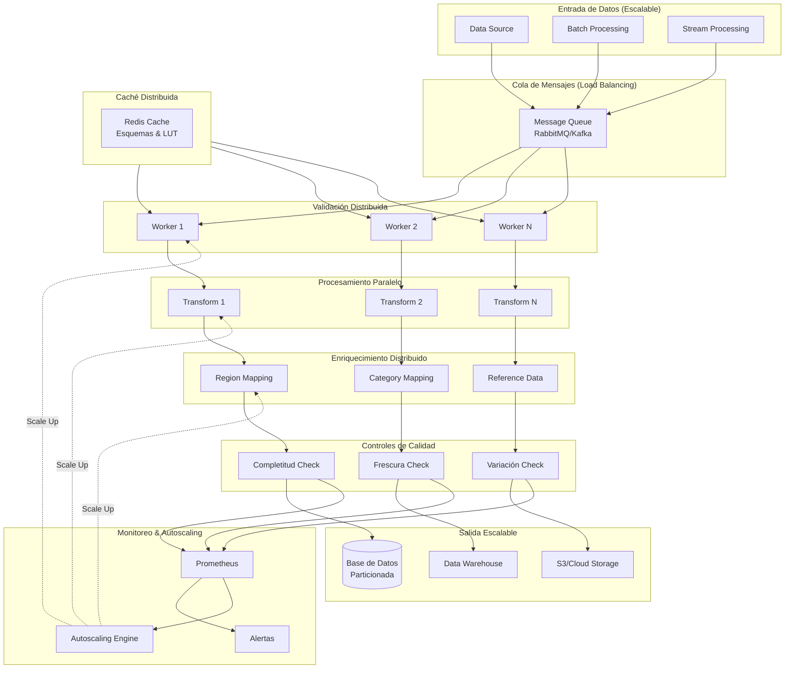

# Diagrama de Escalabilidad del Pipeline

## Arquitectura Escalable del Pipeline de Ventas

Estrategia para escalar el pipeline a medida que crece el volumen de datos:



---

## Estrategias de Escalabilidad

### 1. **Escalabilidad Horizontal - Validación**
```
Antes:        Después:
┌─────────┐  ┌──────┬──────┬──────┐
│Worker   │  │W1    │W2    │W3    │
└─────────┘  └──────┴──────┴──────┘
 1 GB/min    3 GB/min (paralelo)
```
- Múltiples validadores en paralelo
- Load balancing con Message Queue
- Replicación de esquemas en caché compartida

### 2. **Escalabilidad de Procesamiento**
```
Datos:     100k filas  -  10M filas  -  100M filas
Workers:   1 worker   -  10 workers -  100 workers
Tiempo:    30 min     -  30 min     -  30 min
```
- Particionamiento de datos por región/producto
- Procesamiento en lotes (micro-batches)
- Streaming para datos en tiempo real

### 3. **Escalabilidad de Almacenamiento**
```
Single Database          Partitioned Database
┌─────────────────┐     ┌──────┬──────┬──────┐
│ +1M rows        │     │ DB1  │ DB2  │ DB3  │
│ Queries         │     │ 500k │ 500k │ 500k │
│ Performance     │     └──────┴──────┴──────┘
└─────────────────┘     Distributed Query
```
- Sharding por región o fecha
- Réplicas de lectura
- Data Warehouse para análisis

### 4. **Caché Distribuida**
```
Lookup Tables (Región Mapping, Productos)
         ↓
   Redis Cluster
   ┌─────────────────┐
   │ Node1: 10GB     │
   │ Node2: 10GB     │
   │ Node3: 10GB     │
   └─────────────────┘
   Acceso < 1ms
```
- Caché en memoria para tablas de referencia
- Replicación automática

---

## Matriz de Escalabilidad

| Scenario | Filas/Día | Workers | Tiempo | Storage |
|----------|-----------|---------|--------|---------|
| Pequeño | 100K | 1 | 5 min | 100MB |
| Mediano | 10M | 5 | 10 min | 10GB |
| Grande | 100M | 20 | 15 min | 100GB |
| Very Large | 1B+ | 50+ | 20-30 min | 1TB+ |

### Recomendaciones por Escala

**Escala Pequeña (< 1M filas/día)**
- Pipeline secuencial
- Base de datos única
- Caché local

**Escala Mediana (1M - 100M filas/día)**
- Validación paralela (5-10 workers)
- Message Queue
- Redis para referencias
- DB con índices optimizados

**Escala Grande (100M - 1B filas/día)**
- Validación altamente distribuida (20+ workers)
- Kafka para streaming
- Redis Cluster
- Sharding de DB
- Data Warehouse separado

**Escala Very Large (> 1B filas/día)**
- Spark/Hadoop cluster
- Kubernetes orchestration
- Multi-region deployment
- Cloud-native architecture
- Auto-scaling (HPA)

---

## Tecnologías Recomendadas

### Orquestación
- **Apache Airflow**: Scheduler y DAG management
- **Kubernetes**: Container orchestration
- **Docker**: Containerización de workers

### Mensajería
- **Apache Kafka**: High-throughput streaming
- **RabbitMQ**: Task queue distribuida
- **AWS SQS**: Queue administrada en cloud

### Caché
- **Redis**: In-memory data store
- **Memcached**: Distribuir caché simple

### Almacenamiento
- **PostgreSQL**: Transaccional
- **Snowflake**: Data warehouse cloud
- **BigQuery**: Data warehouse distribuido
- **S3/GCS**: Object storage

### Monitoreo
- **Prometheus**: Métricas
- **Grafana**: Visualización
- **ELK Stack**: Logs centralizados
- **DataDog/New Relic**: Monitoring APM

---

## Autoscaling Automático

```yaml
Trigger Rules:
- CPU > 70% → Scale Up (+2 workers)
- Memory > 80% → Scale Up (+1 worker)
- Queue Depth > 10k → Scale Up (+3 workers)
- CPU < 20% × 5min → Scale Down (-1 worker)

Min Workers: 1
Max Workers: 100
Scale-up Delay: 30s
Scale-down Delay: 5min
```

---

## Arquitectura Global (Multi-región)

```
┌─────────────────────────────────────┐
│      Global Load Balancer           │
├─────────────────────────────────────┤
│ US-EAST │ EU-WEST │ ASIA-PACIFIC    │
│  ┌────┐ │  ┌────┐ │  ┌────┐         │
│  │ P1 │ │  │ P2 │ │  │ P3 │         │
│  └────┘ │  └────┘ │  └────┘         │
├─────────────────────────────────────┤
│   Central Data Warehouse            │
└─────────────────────────────────────┘

Replication: Master-Master
Consistency: Eventually Consistent
Latency: < 100ms global
```
